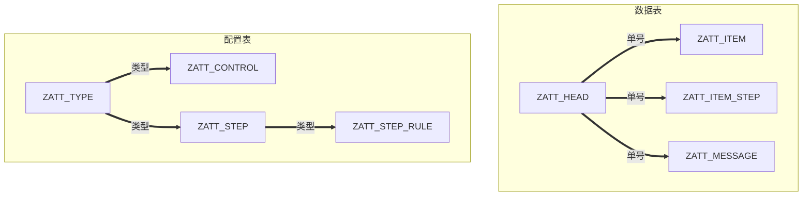
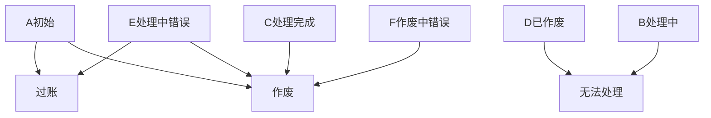

# 业务需求说明

支持多步骤业务的修改、冲销、出问题需要多个程序互相查看。所以设计自动交易逻辑替代以上功能的额外部分。

此功能为模块化功能，支持独立导入实现，支持上线切换的业务需求。

# 数据结构设计

## 概览

| 表             | 名称           |
| -------------- | -------------- |
| ZATT_HEAD      | 自动交易抬头表 |
| ZATT_ITEM      | 自动交易项目表 |
| ZATT_ITEM_STEP | 执行顺序       |
| ZATT_MESSAGE   | 处理消息日志   |


| 表             | 表名称           |
| -------------- | ---------------- |
| ZATT_TYPE      | 交易类型配置表   |
| ZATT_CONTROL   | 自动交易字段控制 |
| ZATT_STEP      | 自动交易步骤     |
| ZATT_STEP_RULE | 执行规则         |



## 配置表


-----


| 表名           | 表位置 |        字段名 | 关键字段 | 数据元素                 | 数据类型 | 字符数 | 长字段标签    |
| :------------- | ------ | ------------: | -------- | ------------------------ | -------- | ------ | ------------- |
| ZATT_TYPE      | 1      |         MANDT | X        | MANDT                    | CLNT     | 3      | 集团          |
| ZATT_TYPE      | 2      |          TYPE | X        | ZATD_TYPE                | CHAR     | 10     | 交易类型      |
| ZATT_TYPE      | 3      |     TYPE_NAME |          | AWTXT                    | CHAR     | 40     | 名称          |
| ZATT_TYPE      | 4      |         IMMED |          | ZATD_IMMED               | CHAR     | 1      | 立即执行      |
| ZATT_CONTROL   | 1      |         MANDT | X        | MANDT                    | CLNT     | 3      | 集团          |
| ZATT_CONTROL   | 2      |          TYPE | X        | ZATD_TYPE                | CHAR     | 10     | 交易类型      |
| ZATT_CONTROL   | 3      |        DZAEHK | X        | DZAEHK                   | NUMC     | 3      | 计数器        |
| ZATT_CONTROL   | 4      |      FIELDALV |          | ZATD_FIELDALV            | CHAR     | 4      | 字段位置      |
| ZATT_CONTROL   | 5      |     FIELDNAME |          | FIELDNAME                | CHAR     | 30     | 字段名        |
| ZATT_CONTROL   | 6      |       COLTEXT |          | COLTEXT                  | CHAR     | 30     | 列文本        |
| ZATT_CONTROL   | 7      |          EDIT |          | ZATD_EDIT                | CHAR     | 1      | 可编辑        |
| ZATT_CONTROL   | 8      |         REQUI |          | ZATD_NOTNULL             | CHAR     | 1      | 非空          |
| ZATT_CONTROL   | 9      |         HIDDE |          | ZATD_HIDDE               | CHAR     | 1      | 隐藏          |
| ZATT_CONTROL   | 10     |     EMPHASIZE |          | LVC_EMPHSZ               | CHAR     | 4      | 突出显示列    |
| ZATT_CONTROL   | 11     |      ROLLNAME |          | ROLLNAME                 | CHAR     | 30     | 数据元素      |
| ZATT_CONTROL   | 12     |      ZDEFAULT |          | ZATD_DEFAULT             | CHAR     | 40     | 默认值        |
| ZATT_CONTROL   | 13     |  UPLOAD_INDEX |          | ZATD_UPLOAD_INDEX        | INT1     | 3      | 导入序号      |
| ZATT_STEP      | 1      |         MANDT | X        | MANDT                    | CLNT     | 3      | 集团          |
| ZATT_STEP      | 2      |          TYPE | X        | ZATD_TYPE                | CHAR     | 10     | 交易类型      |
| ZATT_STEP      | 3      |          STEP | X        | ZATD_STEP                | INT1     | 3      | 步骤序号      |
| ZATT_STEP      | 4      |     STEP_NAME |          | AWTXT                    | CHAR     | 40     | 名称          |
| ZATT_STEP      | 5      |     STEP_TYPE |          | ZATD_STEP_TYPE           | CHAR     | 10     |               |
| ZATT_STEP      | 6      |      STEP_RET |          | ZATD_STEP_RET            | CHAR     | 1      | 反向标记      |
| ZATT_STEP_RULE | 1      |         MANDT | X        | MANDT                    | CLNT     | 3      | 集团          |
| ZATT_STEP_RULE | 2      |          TYPE | X        | ZATD_TYPE                | CHAR     | 10     | 交易类型      |
| ZATT_STEP_RULE | 3      |          STEP | X        | ZATD_STEP                | INT1     | 3      | 步骤序号      |
| ZATT_STEP_RULE | 4      |        DZAEHK | X        | DZAEHK                   | NUMC     | 3      | 计数器        |
| ZATT_STEP_RULE | 5      |     RULE_TYPE |          | ZATD_RULE_TYPE           | CHAR     | 1      | 映射类型      |
| ZATT_STEP_RULE | 6      |    TO_TABNAME |          | WRF_TABNAME              | CHAR     | 30     | 结构名称      |
| ZATT_STEP_RULE | 7      |  TO_FIELDNAME |          | WRF_FIELDNAME            | CHAR     | 30     | BAPI 字段名称 |
| ZATT_STEP_RULE | 8      | FROM_FIELDALV |          | ZATD_FIELDALV            | CHAR     | 4      | 字段位置      |
| ZATT_STEP_RULE | 9      |    FROM_FNAME |          | FIELDNAME                | CHAR     | 30     | 字段名        |
| ZATT_STEP_RULE | 10     | DEFAULT_VALUE |          | COMT_PRCAT_DEFAULT_VALUE | CHAR     | 30     | 默认值        |

## 数据表


| 表             | 名称           |
| -------------- | -------------- |
| ZATT_HEAD      | 自动交易抬头表 |
| ZATT_ITEM      | 自动交易项目表 |
| ZATT_ITEM_STEP | 执行顺序       |
| ZATT_MESSAGE   | 处理消息日志   |

------


| 表名           | 表位置 | 字段名    | 关键字段 | 数据元素       | 数据类型 | 字符数 | 长字段标签     |
| -------------- | ------ | --------- | -------- | -------------- | -------- | ------ | :------------- |
| ZATT_HEAD      | 1      | MANDT     | X        | MANDT          | CLNT     | 3      | 集团           |
| ZATT_HEAD      | 2      | ATNO      | X        | ZATD_ATNO      | CHAR     | 10     | 交易单号       |
| ZATT_HEAD      | 3      | EXORD     |          | ZATD_EXORD     | CHAR     | 50     | 外部单号       |
| ZATT_HEAD      | 4      | BUDAT     |          | BUDAT          | DATS     | 8      | 过账日期       |
| ZATT_HEAD      | 5      | STATUS    |          | ZATD_STATUS    | CHAR     | 1      | 交易状态       |
| ZATT_HEAD      | 6      | TYPE      |          | ZATD_TYPE      | CHAR     | 10     | 交易类型       |
| ZATT_HEAD      | 7      | TYPE_NAME |          | AWTXT          | CHAR     | 40     | 名称           |
| ZATT_HEAD      | 8      | MENGE     |          | MENGE_D        | QUAN     | 13     | 数量           |
| ZATT_HEAD      | 9      | AMOUNT    |          | ZATD_AMOUNT    | CURR     | 15     | 金额           |
| ZATT_HEAD      | 10     | KUNNR     |          | KUNNR          | CHAR     | 10     | 客户           |
| ZATT_HEAD      | 11     | LIFNR     |          | LIFNR          | CHAR     | 10     | 供应商         |
| ZATT_HEAD      | 12     | RESWK     |          | RESWK          | CHAR     | 4      | 供货工厂       |
| ZATT_HEAD      | 13     | EKORG     |          | EKORG          | CHAR     | 4      | 采购组织       |
| ZATT_HEAD      | 14     | EKGRP     |          | EKGRP          | CHAR     | 3      | 采购组         |
| ZATT_HEAD      | 15     | BUKRS     |          | BUKRS          | CHAR     | 4      | 公司代码       |
| ZATT_HEAD      | 16     | VKORG     |          | VKORG          | CHAR     | 4      | 销售组织       |
| ZATT_HEAD      | 17     | VTWEG     |          | VTWEG          | CHAR     | 2      | 分销渠道       |
| ZATT_HEAD      | 18     | SPART     |          | SPART          | CHAR     | 2      | 产品组         |
| ZATT_HEAD      | 19     | WERKS     |          | WERKS_D        | CHAR     | 4      | 工厂           |
| ZATT_HEAD      | 20     | LGORT     |          | LGORT_D        | CHAR     | 4      | 存储地点       |
| ZATT_HEAD      | 21     | UMWRK     |          | UMWRK          | CHAR     | 4      | 接收工厂       |
| ZATT_HEAD      | 22     | UMLGO     |          | UMLGO          | CHAR     | 4      | 收货库存地点   |
| ZATT_HEAD      | 23     | DOCNUM    |          | EDI_DOCNUM     | NUMC     | 16     | IDoc 号码      |
| ZATT_HEAD      | 24     | EBELN     |          | EBELN          | CHAR     | 10     | 采购凭证       |
| ZATT_HEAD      | 25     | ERDAT     |          | ERDAT          | DATS     | 8      | 创建日期       |
| ZATT_HEAD      | 26     | ERZET     |          | ERZET          | TIMS     | 6      | 时间           |
| ZATT_HEAD      | 27     | ERNAM     |          | ERNAM          | CHAR     | 12     | 创建人         |
| ZATT_HEAD      | 28     | AEDAT     |          | AEDAT          | DATS     | 8      | 更改日期       |
| ZATT_HEAD      | 29     | AETIM     |          | AEZEIT         | TIMS     | 6      | 更改时间       |
| ZATT_HEAD      | 30     | AENAM     |          | AENAM          | CHAR     | 12     | 更改人         |
| ZATT_ITEM      | 1      | MANDT     | X        | MANDT          | CLNT     | 3      | 集团           |
| ZATT_ITEM      | 2      | ATNO      | X        | ZATD_ATNO      | CHAR     | 10     | 交易单号       |
| ZATT_ITEM      | 3      | ATNR      | X        | ZATD_ATNR      | NUMC     | 6      | 行号           |
| ZATT_ITEM      | 4      | EXORD     |          | ZATD_EXORD     | CHAR     | 50     | 外部单号       |
| ZATT_ITEM      | 5      | EXNR      |          | ZATD_EXNR      | NUMC     | 6      | 外部行号       |
| ZATT_ITEM      | 6      | MATNR     |          | MATNR          | CHAR     | 40     | 物料           |
| ZATT_ITEM      | 7      | MAKTX     |          | MAKTX          | CHAR     | 40     | 物料描述       |
| ZATT_ITEM      | 8      | MENGE     |          | MENGE_D        | QUAN     | 13     | 数量           |
| ZATT_ITEM      | 9      | MEINS     |          | MEINS          | UNIT     | 3      | 基本计量单位   |
| ZATT_ITEM      | 10     | PRICE     |          | ZATD_PRICE     | CURR     | 15     | 单价           |
| ZATT_ITEM      | 11     | AMOUNT    |          | ZATD_AMOUNT    | CURR     | 15     | 金额           |
| ZATT_ITEM      | 12     | WAERS     |          | WAERS          | CUKY     | 5      | 货币           |
| ZATT_ITEM      | 13     | WERKS     |          | WERKS_D        | CHAR     | 4      | 工厂           |
| ZATT_ITEM      | 14     | LGORT     |          | LGORT_D        | CHAR     | 4      | 存储地点       |
| ZATT_ITEM      | 15     | UMWRK     |          | UMWRK          | CHAR     | 4      | 接收工厂       |
| ZATT_ITEM      | 16     | UMLGO     |          | UMLGO          | CHAR     | 4      | 收货库存地点   |
| ZATT_ITEM_STEP | 1      | MANDT     | X        | MANDT          | CLNT     | 3      | 集团           |
| ZATT_ITEM_STEP | 2      | ATNO      | X        | ZATD_ATNO      | CHAR     | 10     | 交易单号       |
| ZATT_ITEM_STEP | 3      | STEP      | X        | ZATD_STEP      | INT1     | 3      | 步骤序号       |
| ZATT_ITEM_STEP | 4      | TYPE      |          | ZATD_TYPE      | CHAR     | 10     | 交易类型       |
| ZATT_ITEM_STEP | 5      | TYPE_NAME |          | AWTXT          | CHAR     | 40     | 名称           |
| ZATT_ITEM_STEP | 6      | STEP_NAME |          | AWTXT          | CHAR     | 40     | 名称           |
| ZATT_ITEM_STEP | 7      | STEP_TYPE |          | ZATD_STEP_TYPE | CHAR     | 10     |                |
| ZATT_ITEM_STEP | 8      | STEP_RET  |          | ZATD_STEP_RET  | CHAR     | 1      | 反向标记       |
| ZATT_ITEM_STEP | 9      | STATUS    |          | ZATD_STATUS    | CHAR     | 1      | 交易状态       |
| ZATT_ITEM_STEP | 10     | MSGTX     |          | MSGTX          | CHAR     | 100    |                |
| ZATT_ITEM_STEP | 11     | DOCNR     |          | DOCNR          | CHAR     | 10     | 凭证编号       |
| ZATT_ITEM_STEP | 12     | CJAHR     |          | MJAHR          | NUMC     | 4      | 物料凭证的年份 |
| ZATT_ITEM_STEP | 13     | C_DOCNR   |          | DOCNR          | CHAR     | 10     | 凭证编号       |
| ZATT_ITEM_STEP | 14     | C_CJAHR   |          | MJAHR          | NUMC     | 4      | 物料凭证的年份 |
| ZATT_ITEM_STEP | 15     | UNAME     |          | USNAM          | CHAR     | 12     | 用户名         |
| ZATT_ITEM_STEP | 16     | AEDAT     |          | AEDAT          | DATS     | 8      | 更改日期       |
| ZATT_ITEM_STEP | 17     | AETIM     |          | PSOTM          | TIMS     | 6      | 更改于         |
| ZATT_MESSAGE   | 1      | MANDT     | X        | MANDT          | CLNT     | 3      | 集团           |
| ZATT_MESSAGE   | 2      | ATNO      | X        | ZATD_ATNO      | CHAR     | 10     | 交易单号       |
| ZATT_MESSAGE   | 3      | TIMES     | X        | ZATD_NUMBER    | INT1     | 3      | 次数           |
| ZATT_MESSAGE   | 4      | LINE      | X        | MB_LINE_ID     | NUMC     | 6      | 标识           |
| ZATT_MESSAGE   | 5      | STEP      |          | ZATD_STEP      | INT1     | 3      | 步骤序号       |
| ZATT_MESSAGE   | 6      | MSGTY     |          | MSGTY          | CHAR     | 1      | 消息类型       |
| ZATT_MESSAGE   | 7      | MSGID     |          | MSGID          | CHAR     | 20     | 信息类别       |
| ZATT_MESSAGE   | 8      | MSGNO     |          | MSGNO          | CHAR     | 3      | 消息编号       |
| ZATT_MESSAGE   | 9      | MSGV1     |          | MSGV1          | CHAR     | 50     | 信息变量       |
| ZATT_MESSAGE   | 10     | MSGV2     |          | MSGV2          | CHAR     | 50     | 信息变量       |
| ZATT_MESSAGE   | 11     | MSGV3     |          | MSGV3          | CHAR     | 50     | 信息变量       |
| ZATT_MESSAGE   | 12     | MSGV4     |          | MSGV4          | CHAR     | 50     | 信息变量       |
| ZATT_MESSAGE   | 13     | MESSAGE   |          | BAPI_MSG       | CHAR     | 220    | 消息文本       |
| ZATT_MESSAGE   | 14     | ERNAM     |          | ERNAM          | CHAR     | 12     | 创建人         |
| ZATT_MESSAGE   | 15     | ERDAT     |          | ERDAT          | DATS     | 8      | 创建日期       |
| ZATT_MESSAGE   | 16     | ERZET     |          | ERZET          | TIMS     | 6      | 时间           |

# 程序设计概要

该程序包含以下组成部分：

```Mermaid
graph TD
    主要功能函数-->创建
    主要功能函数-->检查
    主要功能函数-->记账
    主要功能函数-->冲销
    主要功能函数-->动态检查
    报表程序-->查询处理
    报表程序-->批量导入
    业务对象-->IDOC服务
    业务对象-->GOS关系浏览器
```

-   主要功能函数：(函数组ZAT_GO)
    1.  ZAT_CREATE 处理对象创建
    2.  ZAT_CHECK 可以对值进行预检查，大部分逻辑与创建相同
    3.  ZAT_POST 可以对已保存的对象执行过账
    4.  ZAT_CANCEL 反向自动执行冲销
    5.  ZAT_VALUE_CHECK 根据配置动态检查值
-   主要报表程序
    1.  ZAT_QUERY 查询ZAT对象信息，包括数据、处理日志、处理步骤， 并且可以触发执行或者冲销等操作。
    2.  ZAT_IMPORT按照配置生成模板并可以执行上传批导入
-   业务对象ZAT
    1.  基于函数ZAT_CRAETE发布IDOC接口，支持LSMW大批量导入，支持切换。
    2.  基于业务对象的GOS关系，关联AT对象生成的所有后续单据。


# 主体函数实现

## 创建（ZAT_CREATE）


执行逻辑如下：


1.   函数ZAT_CLEAR,清空函数组全局变量	` CALL FUNCTION 'ZAT_CLEAR'.`

2.   根据传入的业务类型读取4个配置表，表名可见数据结构配置表部分。否则报错。`PERFORM frm_get_config."获取配置`

3.   检查EXORD的同交易类型的唯一性,排除已删除。若不唯一则报错。

     ~~~ABAP
       PERFORM frm_exord_check ."检查重复性
       
       SELECT SINGLE atno FROM zatt_head
                   WHERE exord = @gs_head-exord
                       AND type = @g_type
                       AND status <> 'D'
                       INTO @DATA(l_atno).
     ~~~

4.   通过配置表`ZAT_CONTORL`,调用`ZAT_CHECK_VALUE`检查函数输入抬头、项目字段的合法性和必填。检查逻辑详见`ZAT_CHECK_VALUE`的功能说明。

     ~~~ABAP
     PERFORM frm_check_head_data."动态检查抬头
     PERFORM frm_check_item_data."动态检查项目
     ~~~

5.   按照`ZAT_CONTORL`的默认值配置，为字段赋默认值。

     -   汇总明细的总数量、总金额到抬头字段。
     -   默认状态为A。
     -   项目为物料号获取物料描述和计量单位

     ```ABAP
     PERFORM frm_init_head."初始化抬头单号、默认值
     PERFORM frm_init_item."初始化项目单号、行号、默认值
     PERFORM frm_init_item_text."处理物料描述/单位
     ```

6.   按照`ZAT_STEP`初始化该对象的要执行的步骤

     ~~~ABAP
     PERFORM frm_init_item_step."初始化处理步骤
     ~~~

7.   按照配置表`ZAT_CONTORL`·将抬头的必填项目刷入项目。

     ​	若配置抬头的某个字段不为空，而且项目中也有该字段，则将抬头该字段赋值到项目中。

     ```ABAP
      PERFORM frm_move_head_to_item."抬头值刷入项目
     ```

8.   保存数据到表 `ZATT_HEAD / ZATT_ITEM / ZATT_ITEM_STEP`中。

9.   若该类型配置为立即执行，则触发POST逻辑。详见POST执行逻辑。

10.   返回该单的状态及单号，返回消息。

## 状态控制

​	状态控制逻辑如下：




| 状态 | 描述       | 可执行                 | 状态灯   |
| ---- | ---------- | ---------------------- | -------- |
| A    | 初始       | 可以过账、作废。       | 黄色     |
| B    | 处理中     | 中间状态，一般不会有。 | 无       |
| C    | 处理完成   | 可以作废。             | 绿色     |
| D    | 已作废     | 无法继续处理。         | 垃圾桶   |
| E    | 处理中错误 | 可以过账、作废。       | 红色     |
| F    | 作废中错误 | 可以继续作废。         | 消息错误 |

## 过账（ZAT_POST）

1.   传入类型、单号、过账日期，获取该类型的单号、配置等，触发过账逻辑。

2.   由于不同的步骤类型需要调用不同BAPI，这里通过配置表`ZAT_STEP_RULE` 动态传递参数，按该单的`ITEM_STEP`获取配置`ZATT_STEP_RULE`每一步对应的RULE。循环RULE执行逻辑。搭配映射类型与字段值的逻辑，实现AT单据信息对各类BAPI结构的传值。

     1.   映射类型		

          -   映射类型 G：全局单值对象，让定义的字段`FIELDNAME`等于值。

          -   映射类型 H:行对象，让定义的结构名称`TO_TABNAME`的字段`FIELDNAME`等于值。

          -   映射类型 I：表对象，为每一行ITEM重复执行，让定义的表名称`TO_TABNAME`的字段`FIELDNAME`等于值。

3.   字段值

     -   HEAD,获取`ZATT_HEAD`的行字段`FROM_FNAME`作为值。

     -   ITEM,获取`ZATT_ITEM`的表字段`FROM_FNAME`作为值，只能搭配映射I使用。

     -   空，使用配置`DEFAULT_VALUE`作为默认值。

     -   LAST，获取上一步的单号作为值。可搭配`DEFAULT_VALUE`指定步骤号，默认上一个。

     3.   默认X结构处理

          -   某些BAPI结构、内表需要配置X表使用。

-   动态指针获取表名+X存在，若该字段类型为BAPIUPDATE,则赋值X,否则赋值原值。

```ABAP
DEFINE mapping.
  FIELD-SYMBOLS:
  <to_t>   TYPE table,
  <to_tx>  TYPE table,
  <to_s>   TYPE any,
  <to_sx>  TYPE any,
  <to_f>   TYPE any,
  <to_fx>  TYPE any.

  DATA:l_fieldname TYPE char40.

  SORT gt_step_rule BY type step rule_type to_tabname.

  LOOP AT gt_step_rule INTO gs_step_rule
      WHERE step = gs_item_step-step
      GROUP BY ( type = gs_step_rule-type
                          step = gs_step_rule-step
                          rule_type = gs_step_rule-rule_type
                          to_tabname = gs_step_rule-to_tabname
                          ) INTO DATA(lt_rule).

    CASE lt_rule-rule_type.
    WHEN 'G'.
      LOOP AT GROUP lt_rule INTO DATA(ls_rule).
        ASSIGN (ls_rule-to_fieldname) TO <to_f>.
        CHECK sy-subrc EQ 0.
        PERFORM frm_move_value USING ls_rule CHANGING <to_f>.
      ENDLOOP.
    WHEN 'H'.
      l_fieldname = 'LS_' && lt_rule-to_tabname.
      ASSIGN (l_fieldname) TO <to_s>.
      CHECK sy-subrc EQ 0.
      l_fieldname = 'LS_' && lt_rule-to_tabname && 'X'.
      ASSIGN (l_fieldname) TO <to_sx>.
      LOOP AT GROUP lt_rule INTO ls_rule.
        ASSIGN COMPONENT ls_rule-to_fieldname OF STRUCTURE <to_s> TO <to_f>.
        CHECK sy-subrc EQ 0.
        PERFORM frm_move_value USING ls_rule CHANGING <to_f>.
        ASSIGN COMPONENT ls_rule-to_fieldname OF STRUCTURE <to_sx> TO <to_fx>.
        IF sy-subrc EQ 0.
          PERFORM frm_move_valuex USING <to_f> CHANGING <to_fx>.
        ENDIF.
      ENDLOOP.
    WHEN 'I'.
      l_fieldname = 'LT_' && lt_rule-to_tabname && '[]'.
      ASSIGN (l_fieldname) TO <to_t>.
      CHECK sy-subrc EQ 0.
      l_fieldname = 'LT_' && lt_rule-to_tabname.
      ASSIGN (l_fieldname) TO <to_s>.
      CHECK sy-subrc EQ 0.
      l_fieldname = 'LT_' && lt_rule-to_tabname && 'X[]'.
      ASSIGN (l_fieldname) TO <to_tx>.
      l_fieldname = 'LT_' && lt_rule-to_tabname && 'X'.
      ASSIGN (l_fieldname) TO <to_sx>.

      LOOP AT gt_item INTO gs_item.
        LOOP AT GROUP lt_rule INTO ls_rule.
          ASSIGN COMPONENT ls_rule-to_fieldname  OF STRUCTURE <to_s> TO <to_f>.
          CHECK sy-subrc EQ 0.
          PERFORM frm_move_value USING ls_rule CHANGING <to_f>.
          ASSIGN COMPONENT ls_rule-to_fieldname OF STRUCTURE <to_sx> TO <to_fx>.
          IF sy-subrc EQ 0.
            PERFORM frm_move_valuex USING <to_f> CHANGING <to_fx>.
          ENDIF.
        ENDLOOP.
        IF <to_s> IS ASSIGNED AND <to_t> IS ASSIGNED.
          APPEND <to_s> TO <to_t>.
          CLEAR  <to_s>.
        ENDIF.
        IF <to_sx> IS ASSIGNED AND <to_tx> IS ASSIGNED.
          APPEND <to_sx> TO <to_tx>.
          CLEAR <to_sx>.
        ENDIF.
      ENDLOOP.
    WHEN OTHERS.
    ENDCASE.
  ENDLOOP.
END-OF-DEFINITION.


FORM frm_move_value USING ls_rule TYPE zatt_step_rule
                                        CHANGING fvalue.
  CASE  ls_rule-from_fieldalv.
    WHEN ' '.
      fvalue = ls_rule-default_value.
    WHEN 'HEAD'.
      ASSIGN COMPONENT ls_rule-from_fname OF STRUCTURE gs_head TO FIELD-SYMBOL(<from_f>).
      IF sy-subrc EQ 0.
        fvalue = <from_f>.
        PERFORM fm_zz_move_value USING ls_rule  CHANGING fvalue.
      ENDIF.
    WHEN 'ITEM'.
      ASSIGN COMPONENT ls_rule-from_fname OF STRUCTURE gs_item TO <from_f>.
      IF sy-subrc EQ 0.
        fvalue = <from_f>.
        PERFORM fm_zz_move_value USING ls_rule  CHANGING fvalue.
      ENDIF.
    WHEN 'LAST'.
      DATA:l_docnr TYPE docnr.
      PERFORM frm_get_last_docnr USING ls_rule-from_fname CHANGING l_docnr .
      fvalue = l_docnr.
  ENDCASE.
ENDFORM.


FORM frm_move_valuex USING yvalue
                                        CHANGING fvalue.
  IF cl_abap_typedescr=>describe_by_data( fvalue )->absolute_name = '\TYPE=BAPIUPDATE'.
    fvalue = 'X'.
  ELSE.
    fvalue = yvalue.
  ENDIF.

ENDFORM.
```


3.   过账类型调用详述：

     -   创建采购订单(包含STO)

         ```abap
           "调用BAPI: `BAPI_PO_CREATE1`
           "定义配置结构：
           DATA:ls_pohead  LIKE  bapimepoheader,	
                ls_poheadx LIKE  bapimepoheaderx,
                lt_return  TYPE TABLE OF  bapiret2            WITH HEADER LINE,
                lt_poitem  TYPE TABLE OF  bapimepoitem        WITH HEADER LINE,
                lt_poline  TYPE TABLE OF  bapimeposchedule    WITH HEADER LINE,
                lt_polinex TYPE TABLE OF  bapimeposchedulx    WITH HEADER LINE,
                lt_pocond  TYPE TABLE OF  bapimepocond        WITH HEADER LINE,
                lt_pocondx TYPE TABLE OF  bapimepocondx       WITH HEADER LINE.
         ```

     -   创建销售订单

         ```ABAP
           "调用BAPI SD_SALESDOCUMENT_CREATE
           "定义配置结构：
           DATA: ls_sohead  TYPE bapisdhd1,
                 ls_soheadx TYPE bapisdhd1x,
                 lt_partner TYPE TABLE OF  bapiparnr WITH HEADER LINE,
                 lt_return  TYPE TABLE OF bapiret2 WITH HEADER LINE,
                 lt_soitem  TYPE TABLE OF bapisditm WITH HEADER LINE,
                 lt_soitemx TYPE TABLE OF bapisditmx WITH HEADER LINE,
                 lt_soline  TYPE TABLE OF   bapischdl WITH HEADER LINE,
                 lt_solinex TYPE TABLE OF bapischdlx WITH HEADER LINE,
                 lt_cond    TYPE STANDARD TABLE OF bapicond WITH HEADER LINE,
                 lt_condx   TYPE STANDARD TABLE OF bapicondx WITH HEADER LINE.
         ```

         -     此类型的lt_partner比较特殊，改为特别代码从KNVP获取。`FORM frm_set_partner.`.

     -   创建交货单(STO)

          ```abap
         "调用BAPI BAPI_OUTB_DELIVERY_CREATE_STO
         "定义配置结构：
         DATA:ship_point   TYPE vstel,
              lt_stovlitem TYPE TABLE OF bapidlvreftosto WITH HEADER LINE.
          ```

     -   创建交货单(SO)

          ```abap
         "调用BAPI BAPI_OUTB_DELIVERY_CREATE_SLS
         "定义配置结构：
         DATA:ship_point   TYPE vstel,
              lt_sovlitem TYPE TABLE OF bapidlvreftosalesorder WITH HEADER LINE.
          ```

     -   交货单过账

          ```abap
         "调用BAPI WS_DELIVERY_UPDATE
         "定义配置结构：
           DATA:ls_vlhead    TYPE vbkok,
                vbeln        TYPE vbeln_vl,
                lt_vlitem    TYPE TABLE OF bapiobdlvitemcon WITH HEADER LINE,
                lt_vlcontrol TYPE TABLE OF bapiobdlvitemctrlcon WITH HEADER LINE.
          ```

     -   物料凭证

          ```abap
         "调用BAPI BAPI_GOODSMVT_CREATE
         "定义配置结构：
           DATA:gm_code   TYPE bapi2017_gm_code,
                ls_mbhead TYPE bapi2017_gm_head_01,
                lt_mbitem TYPE TABLE OF bapi2017_gm_item_create WITH HEADER LINE.
          ```

4.   通过以上定义可配置记账规则。注：配置时结构不带`LS_` 表不带`LT_`。

5.   某一步骤处理失败则状态更新为E，总状态也为E，停止继续执行。全部成功则全部为S。

6.   将每一步的处理消息按照单号、步骤号、写入`ZATT_MESSAGE`。

7.   将每一步处理结构更新ZATT_ITEM_STEP的单号、状态、消息等。

8.   每一步生成的单号对象通过GOS绑定到一起。

     		### 检查（ZAT_CHECK）

大致逻辑与ZAT_CREATE一直，使用其中的配置、抬头、项目检查部分，有问题则返回错误。

```ABAP
PERFORM frm_get_config."获取配置
PERFORM frm_exord_check ."检查重复性
PERFORM frm_check_head_data."动态检查抬头
PERFORM frm_check_item_data."动态检查项目
```

## 冲销（ZAT_CANCEL）

大致逻辑与POST一直，检查参考状态判断。

逆向STEP顺序，按类型依次触发取消逻辑。冲销类型详述：

-   采购订单（包含STO）：调用`BAPI_PO_CHANGE`删除订单
-   交货单(STO/SO):调用`BAPI_OUTB_DELIVERY_CHANGE`删除交货单
-   销售订单:调用`BAPI_SALESORDER_CHANGE`删除销售订单
-   交货单过账(STO/SO)：调用`WS_REVERSE_GOODS_ISSUE`冲销交货单
-   物料凭证：调用`BAPI_GOODSMVT_CANCEL`冲销物料凭证

# ZAT_QUERY程序设计

## 选择屏幕设计

-   业务信息：
    -   交易类型
    -   工厂
    -   库存地点
    -   UM工厂
    -   UM库存地点
    -   记账日期
    -   外部单号
-   交易信息
    -   交易编号
    -   创建日期
    -   状态
-   只读标识

以上字段除标识为全部为多选，参考ZAT抬头信息对应字段。

## 查询逻辑

初始化日期为最近三天。

按照选择条件获取4个数据表信息。参见数据表。

预处理信息，为每个状态添加状态灯，详见状态控制。

为消息添加状态灯。W警告，E错误，S成功。

## ALV设计

上下双层ALV，上层为抬头表`ZATT_HEAD`数据，详见结构`ZATS_HEAD`。

下层分为三种，分别展示不同表格：`ZATT_ITEM_STEP`(默认)，`ZATT_ITEM`，`ZATT_MESSAGE`的不同表格。都有各自结构。

抬头ALV事件：

-   双击抬头：显示对应行的明细(三种中的一种)。
-   热点：交易单号：调用GOS对象的关系显示功能。

抬头按钮：

-   显示数据明细：切换下层ALV到 `ZATT_ITEM`的显示模式
-   显示消息：切换下层ALV到 `ZATT_MESSAGE`的显示模式
-   显示步骤：切换下层ALV到 `ZATT_ITEM_STEP`的显示模式
-   刷新：重新按选择屏幕获取数据
-   处理：选中抬头行，调用`ZAT_POST`处理，注意状态判断
-   冲销：选中抬头行，调用`ZAT_CANCEL`处理，注意状态判断。

项目事件：

-   ZATT_ITEM_SETP对应的单号/冲销单号支持热点点开对应凭证。采购订单/交货单/销售订单/物料凭证。

# 业务对象ZAT实现

## SWO1创建类ZAT。

-   继承接口IFGOSXSERV，以实现GOS的关联双向调用。(例如通过PO的抬头跳转到ZAT对象，用QUERY打开)。
-   定义关键字段ATNO，作为实例关键字。
-   重定义方法ZAT.Display，根据关键字调用ZAT_QUERY程序展示对象。

```ABAP
begin_method display changing container.
SUBMIT zat_query WITH s_atno = object-key-atno.
end_method.
```

-   参照函数ZAT_CREATE创建方法ZAT.ZatCreate，并将方法改为API方法。
-   建模->实施->释放该对象。
-   

## BGBG将方法ZAT_CREATE发布EDI对象。

发货会校验TABLES里必须有个参考BAPIRET2的方法。参考的原函数最好只LIKE字段，不要用TYPE，否则生成的函数会有问题需要微调。

可以修改IDOC入站函数，将IDOC对象与ZAT对象关联起来。

## LSMLW实现对象API的调用

详见LSMS对象 BATCH/AT/ZAT_CREATE


​	
